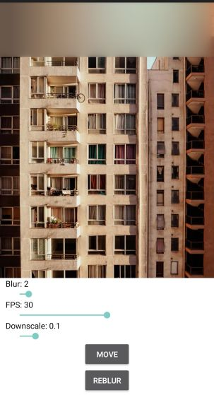

# Ti.BlurView

<br/>

Based on: https://github.com/CameraKit/blurkit-android

```xml
<modules>
  <module platform="android">ti.blurview</module>
</modules>
```

```xml
<BlurView />
```

Methods:
* startBlur()
* pauseBlur()

Properties:
* fps (int)
* blurRadius (int)
* downscaleFactor (float)

Example:

```xml
<Alloy>
	<Window backgroundColor="#fff">
		<ImageView id="img" image="/bg.jpg" width="Ti.UI.FILL" top="0"/>

		<BlurView module="ti.blurview" id="view_blur" blurRadius="2" top="0" downscaleFactor="0.1" width="Ti.UI.FILL" height="100"/>

		<View bottom="0" height="Ti.UI.SIZE" width="Ti.UI.FILL" layout="vertical" backgroundColor="#fff">
			<Label text="Blur: 2" id="lbl_blur" color="#000" left="10"/>
			<Slider min="1" max="20" left="20" right="20" onChange="onChange1" value="2"/>

			<Label text="FPS: 0" id="lbl_fps" color="#000" left="10"/>
			<Slider min="0" max="60" left="20" right="20" onChange="onChange3" value="30"/>

			<Label text="Downscale: 0.1" id="lbl_down" color="#000" left="10"/>
			<Slider min="1" max="100" left="20" right="20" onChange="onChange2" value="10"/>

			<Button title="move" onClick="onClickMove"/>
			<Button title="reblur" onClick="onClickBlur" bottom="10"/>
		</View>
	</Window>
</Alloy>
```

```javascript
function onChange1(e) {
	$.view_blur.blurRadius = Math.round(e.value);
	$.lbl_blur.text = "Blur: " + Math.round(e.value);
}

function onChange2(e) {
	$.view_blur.downscaleFactor = e.value / 100;
	$.lbl_down.text = "Downscale: " + e.value / 100;
}

function onChange3(e) {
	$.view_blur.fps = Math.round(e.value);
	$.lbl_fps.text = "FPS: " + Math.round(e.value);
}

function onClickMove(e) {
	$.view_blur.animate({
		top: 500,
		duration: 5000,
		autoreverse: true
	})
}

function onClickBlur(e) {
	$.view_blur.invalidate();
}

$.index.open();
```
