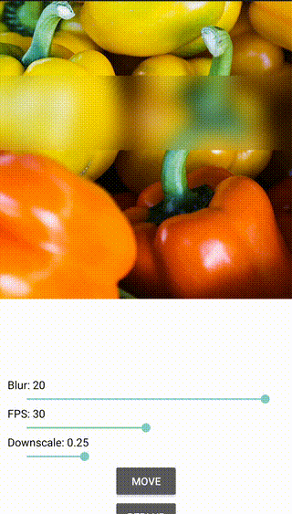

# Ti.Blurview
## Android BlurView module for Appcelerator Titanium

<span class="badge-patreon"><a href="https://www.patreon.com/michaelgangolf" title="Donate to this project using Patreon"></a></span>

<br/>

Simple Android BlurView module for Appcelerator Titanium. Based on: https://github.com/CameraKit/blurkit-android

### Usage

```xml
<modules>
  <module platform="android">ti.blurview</module>
</modules>
```

```xml
<BlurView module="ti.blurview"/>
```
or
```javascript
var blur = require("ti.blurview");
var blurView = blur.createBlurView({});
```

### API

<b>Methods:</b>
* startBlur()
* pauseBlur()
* lockView()
* unlockView()

<b>Properties:</b>
* fps (int)
* blurRadius (int)
* downscaleFactor (float)

### Example:

```javascript
var win = Ti.UI.createWindow({
	backgroundColor: "#fff"
});
var img = Ti.UI.createImageView({
	image: "https://raw.githubusercontent.com/CameraKit/blurkit-android/master/demo/src/main/res/drawable-nodpi/peppers.png",
	width: 640,
	height: 400,
	top: 0
})
var blurview = require("ti.blurview").createBlurView({
	downscaleFactor: 0.25,
	blurRadius: 20,
	width: Ti.UI.FILL,
	height: 100,
	top: 100
});
var view_menu = Ti.UI.createView({
	bottom: 0,
	height: Ti.UI.SIZE,
	width: Ti.UI.FILL,
	layout: "vertical",
	backgroundColor: "#efefef"
})
win.add([img, blurview, view_menu]);

var lbl1 = Ti.UI.createLabel({
	text: "Blur: 2",
	color: "#000",
	left: 10,
	top: 10
});
var lbl2 = Ti.UI.createLabel({
	text: "FPS: 0",
	color: "#000",
	left: 10
});
var lbl3 = Ti.UI.createLabel({
	text: "Downscale: 0.1",
	color: "#000",
	left: 10
});
var slider1 = Ti.UI.createSlider({
	min: 1,
	max: 20,
	left: 20,
	right: 20,
	value: 20,
	bottom: 10
})
var slider2 = Ti.UI.createSlider({
	min: 0,
	max: 60,
	left: 20,
	right: 20,
	value: 30,
	bottom: 10
})
var slider3 = Ti.UI.createSlider({
	min: 1,
	max: 100,
	left: 20,
	right: 20,
	value: 25,
	bottom: 10
})
view_menu.add([lbl1, slider1, lbl2, slider2, lbl3, slider3]);

slider1.addEventListener("change", function(e) {
	blurview.blurRadius = Math.round(e.value);
	lbl1.text = "Blur: " + Math.round(e.value);
});
slider2.addEventListener("change", function(e) {
	blurview.fps = Math.round(e.value);
	lbl2.text = "FPS: " + Math.round(e.value);
});
slider3.addEventListener("change", function(e) {
	blurview.downscaleFactor = (e.value / 100).toFixed(2);
	lbl3.text = "Downscale: " + (e.value / 100).toFixed(2);
});

var btn1 = Ti.UI.createButton({
	title: "move"
})
var btn2 = Ti.UI.createButton({
	title: "reblur",
	bottom: 10
})

view_menu.add([btn1, btn2]);

btn1.addEventListener("click", function(e) {
	blurview.animate({
		top: 400,
		duration: 4000,
		autoreverse: true
	})
});

btn2.addEventListener("click", function(e) {
	blurview.unlockView();
	blurview.invalidate();
	blurview.startBlur();
});

win.open();
```
